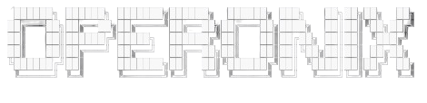

<div align="center">

<picture>
  <source media="(prefers-color-scheme: dark)" srcset="assets/banner-dark.png"/>
  <source media="(prefers-color-scheme: light)" srcset="assets/banner-light.png"/>
  
</picture>

**AI-Powered Desktop Automation & Orchestration Platform**

*Understand. Plan. Execute. Automate.*

<br/>

[](LICENSE)
[](https://python.org)
[](https://github.com/Hanan-Abbas/Operonix)
[](https://github.com/Hanan-Abbas/Operonix)
[](https://github.com/Hanan-Abbas/Operonix)

<br/>

[**Getting Started**](#getting-started) · [**Deployment**](#deployment) · [**Example**](#example-workflow) · [**Why Operonix**](#why-operonix) · [**Architecture**](#architecture) · [**Features**](#features) · [**LLM Providers**](#llm-providers) · [**Plugins**](#plugin-system) · [**Limitations**](#current-limitations) · [**Contributing**](#contributing)

<br/>

</div>

---

## Disclaimer

Operonix is an experimental AI automation platform under active development. Autonomous desktop automation can perform sensitive system actions including file operations, application control, and UI interaction. **Use caution when enabling automation capabilities on production or personal systems.** Review the safety configuration before running agents in unsupervised mode.

---

## What is Operonix?

**Operonix** is an AI-powered desktop automation and orchestration platform that enables agents to understand, plan, and execute real-world computer workflows — using large language models, computer vision, and a modular plugin architecture.

It is built for **developers and teams** who need a structured, extensible foundation for:

- Desktop agents that can reason about goals and act across applications
- AI-assisted workflow automation that adapts to dynamic interfaces
- Multimodal interaction systems combining voice, vision, and text input

Operonix is not a single tool — it is a **platform**. Each layer, from intent parsing to screen interaction, is modular, observable, and designed with reliability and safety as first-class concerns.

---

## Preview

> Screenshots, demo recordings, and architecture visuals will be added as the UI stabilizes. Check back or watch the repository for updates.

---

## Why Operonix?

Most automation tools depend on rigid scripts, fixed APIs, or browser-only environments. They break when interfaces change and require constant manual maintenance.

Operonix is designed differently. It operates directly on the desktop using an LLM-driven reasoning layer that interprets intent, selects appropriate tools, and adapts to varying application states — without depending entirely on hardcoded click paths or application-specific APIs.

The goal is practical: a reliable, observable foundation for building agents that can handle real desktop workflows, with the safety controls and engineering structure needed to deploy them responsibly.

---

## Architecture

Operonix follows a layered architecture where each system has a clear, bounded responsibility. Input flows from voice, panel, or API through the orchestration core and AI brain, then down through safety validation, the executor, and finally into desktop automation. Memory and learning feed results back up to improve future decisions.

```
┌─────────────────────────────────────────────────────────────┐
│                        INPUT LAYER                          │
│          Voice (STT/TTS)  ·  Panel  ·  API / WebSocket      │
└───────────────────────┬─────────────────────────────────────┘
                        │
┌───────────────────────▼─────────────────────────────────────┐
│                   CORE ORCHESTRATOR                         │
│         Event bus · Lifecycle · Config · Watchdog           │
└───────────────────────┬─────────────────────────────────────┘
                        │
┌───────────────────────▼─────────────────────────────────────┐
│                       AI BRAIN                              │
│     Intent parser · Planner · Goal stack · Decision engine  │
│                                        ┌────────────────┐   │
│                                        │  LLM Providers │   │
│                                        │ Ollama · Groq  │   │
│                                        │Gemini · OpenRtr│   │
└───────────────────────┬────────────────└────────────────┘───┘
                        │
          ┌─────────────┴─────────────┐
          │                           │
┌─────────▼──────────┐   ┌────────────▼──────────┐
│      SAFETY        │   │       CONTEXT          │
│ Risk · Audit       │   │ App · Window · Perms   │
│ Sandbox · Guard    │   │ Focus · State          │
└─────────┬──────────┘   └────────────┬───────────┘
          └─────────────┬─────────────┘
                        │
┌───────────────────────▼─────────────────────────────────────┐
│                       EXECUTOR                              │
│          Retry · Fallback · Error classifier · Tracker      │
└────────────────┬─────────────────────┬──────────────────────┘
                 │                     │
┌────────────────▼──────┐   ┌──────────▼────────────────────┐
│     CAPABILITIES      │   │          PLUGINS               │
│ File · Web · UI       │   │ Loader · Sandbox · Health      │
│ Command · Text        │   │ Evolver · Generator · Registry │
└────────────────┬──────┘   └──────────┬────────────────────┘
                 └──────────┬──────────┘
                            │
┌───────────────────────────▼─────────────────────────────────┐
│                   AUTOMATION ENGINE                         │
│     Screen reader · Selector engine · Vision model          │
│              UI fallback · App classifier                   │
└────────────────────┬──────────────────┬─────────────────────┘
                     │                  │
          ┌──────────▼────────┐   ┌─────▼───────────────────┐
          │      MEMORY       │   │       LEARNING           │
          │ Episodic · Session│   │ Patterns · Prompt trust  │
          │ Long-term · Vector│   │ Pruning · Retriever      │
          └───────────────────┘   └─────────────────────────┘
                          ▲
                          └─── feedback loop → Brain
```

---

## Features

### 🧠 AI Brain & Planner
An LLM-driven reasoning core that parses natural language intent, builds goal stacks, and generates multi-step execution plans. A reflector module reviews outcomes after each cycle to inform the next decision.

### 🔌 Modular Plugin System
Plugins are dynamically loaded, sandboxed, and health-monitored at runtime. The platform includes experimental tooling for capability-gap detection and assisted plugin generation — allowing new actions to be scaffolded from templates without manual wiring.

### 🖥️ Desktop Automation
A layered automation stack including a screen reader, UI element selector engine, and a computer vision-based fallback for cases where standard selectors are unavailable. Operates across applications without requiring API access.

### 🎙️ Voice Interface
An end-to-end voice pipeline with wake word detection, noise filtering, and support for both local and cloud-based speech recognition and synthesis.

### 📊 Real-Time Dashboard
A browser-based dashboard connected via WebSocket, providing live log streaming, action inspection, plugin management, system health monitoring, and mode switching.

### 🧠 Memory & Learning
A three-tier memory system covering short-term session context, episodic event history, and long-term vector storage via ChromaDB. A separate learning subsystem tracks action outcomes, applies prompt trust scoring, and prunes low-value patterns over time. Both are under active development.

### 🛡️ Safety & Validation
Risk rules are evaluated before every action. A permission guard enforces capability boundaries. Plugin and automation actions run inside a sandboxed environment, and a full audit log is maintained for every session.

### 🐛 Debugging & Recovery
An error listener captures failures at runtime. The debugging subsystem includes an auto-fix module for suggesting patches and a rollback manager for recovering from failed execution attempts.

---

## LLM Providers

Operonix uses a modular provider system. Backends can be swapped without changing agent logic:

| Provider | Type | Best For |
|---|---|---|
| **Ollama** (Llama 3, Mistral, etc.) | Local | Privacy-first deployments, offline use, no API cost |
| **Groq** | Cloud | Low-latency inference |
| **Gemini** | Cloud | Google multimodal models |
| **OpenRouter** | Cloud | Unified access to multiple model providers |

Configure your provider in `.env` or `core/config.py`.

---

## Getting Started

### Prerequisites

- **OS:** Linux
- **Python:** 3.11 or higher
- **System dependencies:** Installed by `setup.sh`
- **Optional:** [Ollama](https://ollama.com/) for local LLM execution

### Installation

**1. Clone the repository**

```bash
git clone https://github.com/Hanan-Abbas/Operonix.git
cd Operonix
```

**2. Run the setup script**

```bash
chmod +x setup.sh
./setup.sh
```

**3. Configure your AI provider**

```bash
cp .env.example .env
# Add your provider credentials
```

**4. (Optional) Start Ollama for local inference**

```bash
ollama pull llama3
ollama serve
```

**5. Launch Operonix**

```bash
python3 -m core.main
```

---

## Example Workflow

Here is how a natural language request moves through the Operonix pipeline end to end:

```text
User: "Open Firefox and search for autonomous agents"

→ Voice / Panel receives input
→ Intent parser identifies goal and required actions
→ Planner generates a multi-step execution plan
→ Safety validator checks permissions and risk rules
→ Executor dispatches steps with retry logic
→ Automation engine launches Firefox and interacts with the UI
→ Result is logged to memory and surfaced in the dashboard
```

Each step is observable, logged, and — where relevant — validated before the next begins.

---

## Current Limitations

Operonix is in active development. The following constraints apply in the current state:

- **Linux only** — Windows and macOS are not yet supported
- **Desktop environment compatibility** — behaviour may vary across display managers and window managers
- **Vision-based automation is experimental** — accuracy depends on screen resolution and application layout
- **Some plugins require manual permission approval** before the agent can invoke them
- **Long-running autonomous workflows** are still being refined and may require human checkpoints
- **Voice pipeline** is functional but not yet production-stable across all audio configurations

These are known areas of active work, not fundamental design constraints.

---

## Plugin System

Plugins extend agent capabilities and live under `plugins/installed/`. Each plugin requires:

```
plugins/installed/
└── my_plugin/
    ├── manifest.json     # Metadata, declared capabilities, required permissions
    ├── plugin.py         # Implementation
    └── tests/
        └── test_plugin.py
```

**Included plugins:**

| Plugin | Description |
|---|---|
| `app_opening_plugin` | Opens desktop applications by name |
| `auto_clicker_plugin` | Executes automated click sequences |

New plugins are validated against a manifest schema and run inside the plugin sandbox before being made available to the agent.

---

## Project Structure

```
operonix/
├── core/           # Orchestrator, event bus, config, lifecycle, watchdog
├── brain/          # LLM client, intent parser, planner, decision engine
├── executor/       # Task execution, retry, fallback, error classification
├── capabilities/   # File, web, UI, text, and shell operations
├── automation/     # Screen reader, selector engine, vision model, UI fallback
├── context/        # Window detection, app classification, focus, permissions
├── plugins/        # Plugin loader, registry, sandbox, health monitor, generator
├── memory/         # Episodic, session, and long-term vector memory (ChromaDB)
├── learning/       # Pattern tracking, prompt trust scoring, pruning, retrieval
├── safety/         # Permission guard, risk rules, audit log, sandbox, validator
├── voice/          # STT/TTS, wake word, noise filtering, mic pipeline
├── tools/          # Shell, file, API, UI, Ollama executor, tool registry
├── debugging/      # Error listener, auto-fix, parser, rollback manager
├── panel/          # Hotkey listener, input adapter, panel renderer
├── api/            # REST routes (actions, logs, plugins, system, health) + WebSocket
└── dashboard/      # Browser-based frontend with live components
```

---

## Development Status

| System | Status |
|---|---|
| Core orchestrator and event bus | ✅ Operational |
| AI brain — intent parsing and planning | ✅ Operational |
| Executor with retry and fallback | ✅ Operational |
| Desktop automation (screen reader, selector engine) | ✅ Operational |
| Plugin loader, sandbox, and health monitor | ✅ Operational |
| REST API and WebSocket layer | ✅ Operational |
| Safety validation and audit logging | ✅ Operational |
| Voice pipeline | 🔄 In progress |
| Learning and pattern memory | 🔄 In progress |
| Dashboard UI | 🔄 In progress |
| Documentation and architecture visuals | 📋 Planned |

---

## Contributing

Contributions are welcome. To get started:

1. Fork the repository
2. Create a feature branch — `git checkout -b feature/your-feature`
3. Commit your changes — `git commit -m 'Add your feature'`
4. Push to your branch — `git push origin feature/your-feature`
5. Open a Pull Request

Please follow the existing module structure. New capabilities should include tests. New plugins must pass the built-in plugin validator before merging.

---

## License

Released under the **MIT License** — see [LICENSE](LICENSE) for details.

---

<div align="center">

Built by [Hanan Abbas](https://github.com/Hanan-Abbas/Operonix) &nbsp;·&nbsp; [github.com/Hanan-Abbas/Operonix](https://github.com/Hanan-Abbas/Operonix)

</div>